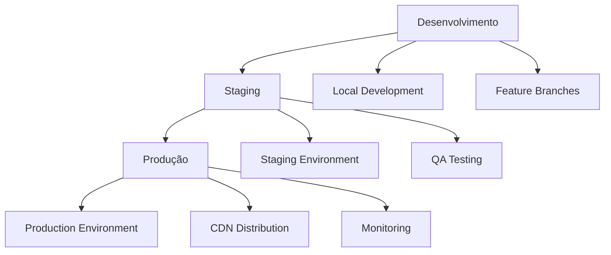

# Guia de Deploy - GESTK Frontend

## 📋 Visão Geral

Este documento detalha o processo de deploy do GESTK Frontend em diferentes ambientes, desde desenvolvimento até produção.

## 🏗️ Arquitetura de Deploy

### Estrutura de Ambientes



### URLs de Ambiente

- **Desenvolvimento**: `http://localhost:3000` (admin) / `http://localhost:3001` (client)
- **Staging**: `https://staging.gestk.com`
- **Produção**: `https://app.gestk.com`

## 🚀 Deploy Local

### Pré-requisitos

```bash
# Node.js 18+
node --version

# npm 9+
npm --version

# Git
git --version
```

### Configuração Inicial

```bash
# 1. Clone do repositório
git clone https://github.com/gestk/gestk-frontend.git
cd gestk-frontend

# 2. Instalação de dependências
npm install

# 3. Configuração de variáveis
cp apps/admin/.env.example apps/admin/.env.local
cp apps/client/.env.example apps/client/.env.local

# 4. Execução em desenvolvimento
npm run dev
```

### Scripts de Desenvolvimento

```bash
# Executar todas as aplicações
npm run dev

# Executar apenas admin
npm run dev:admin

# Executar apenas client
npm run dev:client

# Build de produção local
npm run build

# Linting e formatação
npm run lint
npm run format
```

## 🐳 Deploy com Docker

### Dockerfile Principal

```dockerfile
# Dockerfile
FROM node:18-alpine AS base

# Install dependencies only when needed
FROM base AS deps
RUN apk add --no-cache libc6-compat
WORKDIR /app

# Install dependencies based on the preferred package manager
COPY package.json package-lock.json* ./
RUN npm ci

# Rebuild the source code only when needed
FROM base AS builder
WORKDIR /app
COPY --from=deps /app/node_modules ./node_modules
COPY . .

# Build applications
RUN npm run build

# Production image, copy all the files and run next
FROM base AS runner
WORKDIR /app

ENV NODE_ENV production

RUN addgroup --system --gid 1001 nodejs
RUN adduser --system --uid 1001 nextjs

# Copy built applications
COPY --from=builder /app/apps/admin/.next/standalone ./
COPY --from=builder /app/apps/admin/public ./apps/admin/public
COPY --from=builder /app/apps/client/.next/standalone ./
COPY --from=builder /app/apps/client/public ./apps/client/public

USER nextjs

EXPOSE 3000 3001

CMD ["node", "apps/admin/server.js"]
```

### Docker Compose

```yaml
# docker-compose.yml
version: '3.8'

services:
  gestk-admin:
    build: .
    ports:
      - "3000:3000"
    environment:
      - NODE_ENV=production
      - NEXT_PUBLIC_API_URL=${API_URL}
    volumes:
      - ./apps/admin/.env.local:/app/apps/admin/.env.local:ro

  gestk-client:
    build: .
    ports:
      - "3001:3001"
    environment:
      - NODE_ENV=production
      - NEXT_PUBLIC_API_URL=${API_URL}
    volumes:
      - ./apps/client/.env.local:/app/apps/client/.env.local:ro

  nginx:
    image: nginx:alpine
    ports:
      - "80:80"
      - "443:443"
    volumes:
      - ./nginx.conf:/etc/nginx/nginx.conf:ro
      - ./ssl:/etc/nginx/ssl:ro
    depends_on:
      - gestk-admin
      - gestk-client
```

### Comandos Docker

```bash
# Build das imagens
docker build -t gestk-frontend .

# Executar com docker-compose
docker-compose up -d

# Logs
docker-compose logs -f

# Parar serviços
docker-compose down
```

## ☁️ Deploy na Vercel

### Configuração do Vercel

```json
// vercel.json
{
  "version": 2,
  "builds": [
    {
      "src": "apps/admin/package.json",
      "use": "@vercel/next",
      "config": {
        "distDir": ".next"
      }
    },
    {
      "src": "apps/client/package.json",
      "use": "@vercel/next",
      "config": {
        "distDir": ".next"
      }
    }
  ],
  "routes": [
    {
      "src": "/admin/(.*)",
      "dest": "/apps/admin/$1"
    },
    {
      "src": "/(.*)",
      "dest": "/apps/client/$1"
    }
  ]
}
```

### Variáveis de Ambiente

```bash
# Vercel Environment Variables
NEXT_PUBLIC_API_URL=https://api.gestk.com
NEXT_PUBLIC_API_VERSION=v1
NEXTAUTH_SECRET=your-production-secret
NEXTAUTH_URL=https://app.gestk.com
```

### Deploy Automático

```yaml
# .github/workflows/vercel-deploy.yml
name: Deploy to Vercel

on:
  push:
    branches: [main]
  pull_request:
    branches: [main]

jobs:
  deploy:
    runs-on: ubuntu-latest
    steps:
      - uses: actions/checkout@v3
      
      - name: Setup Node.js
        uses: actions/setup-node@v3
        with:
          node-version: '18'
          cache: 'npm'
      
      - name: Install dependencies
        run: npm ci
      
      - name: Build applications
        run: npm run build
      
      - name: Deploy to Vercel
        uses: amondnet/vercel-action@v20
        with:
          vercel-token: ${{ secrets.VERCEL_TOKEN }}
          vercel-org-id: ${{ secrets.ORG_ID }}
          vercel-project-id: ${{ secrets.PROJECT_ID }}
          working-directory: ./
```

## 🚀 Deploy no AWS

### ECS (Elastic Container Service)

```yaml
# ecs-task-definition.json
{
  "family": "gestk-frontend",
  "networkMode": "awsvpc",
  "requiresCompatibilities": ["FARGATE"],
  "cpu": "512",
  "memory": "1024",
  "executionRoleArn": "arn:aws:iam::account:role/ecsTaskExecutionRole",
  "containerDefinitions": [
    {
      "name": "gestk-admin",
      "image": "account.dkr.ecr.region.amazonaws.com/gestk-frontend:latest",
      "portMappings": [
        {
          "containerPort": 3000,
          "protocol": "tcp"
        }
      ],
      "environment": [
        {
          "name": "NODE_ENV",
          "value": "production"
        },
        {
          "name": "NEXT_PUBLIC_API_URL",
          "value": "https://api.gestk.com"
        }
      ],
      "logConfiguration": {
        "logDriver": "awslogs",
        "options": {
          "awslogs-group": "/ecs/gestk-frontend",
          "awslogs-region": "us-east-1",
          "awslogs-stream-prefix": "ecs"
        }
      }
    }
  ]
}
```

### CloudFront Distribution

```json
{
  "Origins": [
    {
      "Id": "gestk-admin-origin",
      "DomainName": "gestk-admin-alb.us-east-1.elb.amazonaws.com",
      "CustomOriginConfig": {
        "HTTPPort": 3000,
        "HTTPSPort": 3000,
        "OriginProtocolPolicy": "http-only"
      }
    }
  ],
  "DefaultCacheBehavior": {
    "TargetOriginId": "gestk-admin-origin",
    "ViewerProtocolPolicy": "redirect-to-https",
    "Compress": true,
    "CachePolicyId": "4135ea2d-6df8-44a3-9df3-4b5a84be39ad"
  },
  "Enabled": true,
  "PriceClass": "PriceClass_100"
}
```

## 🔧 Configuração de Produção

### Variáveis de Ambiente

```bash
# .env.production
NODE_ENV=production
NEXT_PUBLIC_API_URL=https://api.gestk.com
NEXT_PUBLIC_API_VERSION=v1
NEXT_PUBLIC_WS_URL=wss://ws.gestk.com
NEXTAUTH_SECRET=your-super-secret-key-here
NEXTAUTH_URL=https://app.gestk.com
NEXT_PUBLIC_TENANT_ID=default
NEXT_PUBLIC_APP_ENV=production

# Analytics
NEXT_PUBLIC_GA_ID=G-XXXXXXXXXX
NEXT_PUBLIC_SENTRY_DSN=https://your-sentry-dsn

# Monitoring
NEXT_PUBLIC_MONITORING_ENABLED=true
```

### Configuração do Nginx

```nginx
# nginx.conf
upstream gestk_admin {
    server gestk-admin:3000;
}

upstream gestk_client {
    server gestk-client:3001;
}

server {
    listen 80;
    server_name app.gestk.com;
    return 301 https://$server_name$request_uri;
}

server {
    listen 443 ssl http2;
    server_name app.gestk.com;

    ssl_certificate /etc/nginx/ssl/cert.pem;
    ssl_certificate_key /etc/nginx/ssl/key.pem;

    # Security headers
    add_header X-Frame-Options "SAMEORIGIN" always;
    add_header X-Content-Type-Options "nosniff" always;
    add_header X-XSS-Protection "1; mode=block" always;
    add_header Referrer-Policy "strict-origin-when-cross-origin" always;

    # Admin routes
    location /admin {
        proxy_pass http://gestk_admin;
        proxy_http_version 1.1;
        proxy_set_header Upgrade $http_upgrade;
        proxy_set_header Connection 'upgrade';
        proxy_set_header Host $host;
        proxy_set_header X-Real-IP $remote_addr;
        proxy_set_header X-Forwarded-For $proxy_add_x_forwarded_for;
        proxy_set_header X-Forwarded-Proto $scheme;
        proxy_cache_bypass $http_upgrade;
    }

    # Client routes
    location / {
        proxy_pass http://gestk_client;
        proxy_http_version 1.1;
        proxy_set_header Upgrade $http_upgrade;
        proxy_set_header Connection 'upgrade';
        proxy_set_header Host $host;
        proxy_set_header X-Real-IP $remote_addr;
        proxy_set_header X-Forwarded-For $proxy_add_x_forwarded_for;
        proxy_set_header X-Forwarded-Proto $scheme;
        proxy_cache_bypass $http_upgrade;
    }

    # Static files caching
    location /_next/static {
        proxy_pass http://gestk_client;
        expires 1y;
        add_header Cache-Control "public, immutable";
    }
}
```

## 📊 Monitoramento e Logs

### Configuração do Sentry

```typescript
// apps/client/src/lib/sentry.ts
import * as Sentry from '@sentry/nextjs';

Sentry.init({
  dsn: process.env.NEXT_PUBLIC_SENTRY_DSN,
  environment: process.env.NODE_ENV,
  tracesSampleRate: 1.0,
  integrations: [
    new Sentry.BrowserTracing(),
  ],
});
```

### Health Checks

```typescript
// apps/client/src/app/api/health/route.ts
import { NextResponse } from 'next/server';

export async function GET() {
  try {
    // Verificar conectividade com API
    const apiHealth = await fetch(`${process.env.NEXT_PUBLIC_API_URL}/health`);
    
    return NextResponse.json({
      status: 'healthy',
      timestamp: new Date().toISOString(),
      services: {
        api: apiHealth.ok ? 'healthy' : 'unhealthy',
        database: 'healthy', // Implementar verificação real
      }
    });
  } catch (error) {
    return NextResponse.json({
      status: 'unhealthy',
      timestamp: new Date().toISOString(),
      error: error.message
    }, { status: 500 });
  }
}
```

### Logs Estruturados

```typescript
// packages/shared/src/lib/logger.ts
import winston from 'winston';

export const logger = winston.createLogger({
  level: process.env.LOG_LEVEL || 'info',
  format: winston.format.combine(
    winston.format.timestamp(),
    winston.format.errors({ stack: true }),
    winston.format.json()
  ),
  transports: [
    new winston.transports.Console(),
    new winston.transports.File({ filename: 'logs/error.log', level: 'error' }),
    new winston.transports.File({ filename: 'logs/combined.log' }),
  ],
});
```

## 🔒 Segurança

### Headers de Segurança

```typescript
// next.config.ts
const securityHeaders = [
  {
    key: 'X-DNS-Prefetch-Control',
    value: 'on'
  },
  {
    key: 'Strict-Transport-Security',
    value: 'max-age=63072000; includeSubDomains; preload'
  },
  {
    key: 'X-XSS-Protection',
    value: '1; mode=block'
  },
  {
    key: 'X-Frame-Options',
    value: 'SAMEORIGIN'
  },
  {
    key: 'X-Content-Type-Options',
    value: 'nosniff'
  },
  {
    key: 'Referrer-Policy',
    value: 'origin-when-cross-origin'
  }
];

module.exports = {
  async headers() {
    return [
      {
        source: '/(.*)',
        headers: securityHeaders,
      },
    ];
  },
};
```

### Rate Limiting

```typescript
// apps/client/src/lib/rate-limit.ts
import { NextRequest } from 'next/server';

const rateLimitMap = new Map();

export function rateLimit(limit: number = 10, windowMs: number = 60000) {
  return (req: NextRequest) => {
    const ip = req.ip || req.headers.get('x-forwarded-for') || 'unknown';
    const now = Date.now();
    const windowStart = now - windowMs;
    
    if (!rateLimitMap.has(ip)) {
      rateLimitMap.set(ip, []);
    }
    
    const requests = rateLimitMap.get(ip).filter((time: number) => time > windowStart);
    
    if (requests.length >= limit) {
      return new Response('Too Many Requests', { status: 429 });
    }
    
    requests.push(now);
    rateLimitMap.set(ip, requests);
    
    return null;
  };
}
```

## 🚀 CI/CD Pipeline

### GitHub Actions

```yaml
# .github/workflows/deploy.yml
name: Deploy GESTK Frontend

on:
  push:
    branches: [main, develop]
  pull_request:
    branches: [main]

jobs:
  test:
    runs-on: ubuntu-latest
    steps:
      - uses: actions/checkout@v3
      
      - name: Setup Node.js
        uses: actions/setup-node@v3
        with:
          node-version: '18'
          cache: 'npm'
      
      - name: Install dependencies
        run: npm ci
      
      - name: Run linting
        run: npm run lint
      
      - name: Run tests
        run: npm run test
      
      - name: Build applications
        run: npm run build

  deploy-staging:
    needs: test
    runs-on: ubuntu-latest
    if: github.ref == 'refs/heads/develop'
    steps:
      - uses: actions/checkout@v3
      
      - name: Deploy to Staging
        run: |
          # Deploy commands for staging
          echo "Deploying to staging..."

  deploy-production:
    needs: test
    runs-on: ubuntu-latest
    if: github.ref == 'refs/heads/main'
    steps:
      - uses: actions/checkout@v3
      
      - name: Deploy to Production
        run: |
          # Deploy commands for production
          echo "Deploying to production..."
```

## 📋 Checklist de Deploy

### Pré-Deploy

- [ ] Testes passando
- [ ] Build sem erros
- [ ] Variáveis de ambiente configuradas
- [ ] SSL certificados válidos
- [ ] Backup do banco de dados
- [ ] Documentação atualizada

### Deploy

- [ ] Deploy em staging
- [ ] Testes de smoke
- [ ] Deploy em produção
- [ ] Verificação de health checks
- [ ] Monitoramento ativo

### Pós-Deploy

- [ ] Verificação de logs
- [ ] Testes de funcionalidades críticas
- [ ] Notificação da equipe
- [ ] Documentação de rollback
- [ ] Monitoramento de métricas

## 🔄 Rollback

### Estratégia de Rollback

```bash
# Rollback com Docker
docker-compose down
docker-compose up -d --scale gestk-admin=0
docker-compose up -d --image gestk-frontend:previous

# Rollback com Vercel
vercel rollback [deployment-url]

# Rollback com AWS ECS
aws ecs update-service --cluster gestk-cluster --service gestk-service --task-definition gestk-frontend:previous
```

---

**Guia de Deploy** - Atualizado em 2024-12-15

