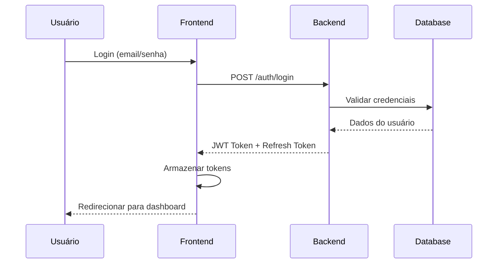

# Integração com Backend GESTK

## 📋 Visão Geral

Este documento detalha como integrar o frontend GESTK com o backend, incluindo configuração de APIs, autenticação, tratamento de dados e implementação de novos endpoints.

## 🔌 Configuração Base

### Variáveis de Ambiente

```bash
# .env.local
NEXT_PUBLIC_API_URL=https://api.gestk.com
NEXT_PUBLIC_API_VERSION=v1
NEXT_PUBLIC_WS_URL=wss://ws.gestk.com

# Autenticação
NEXTAUTH_SECRET=your-secret-key
NEXTAUTH_URL=https://app.gestk.com

# Configurações específicas
NEXT_PUBLIC_TENANT_ID=default
NEXT_PUBLIC_APP_ENV=production
```

### Configuração do Cliente API

```typescript
// packages/shared/src/api/client.ts
import axios from 'axios';

const API_BASE_URL = process.env.NEXT_PUBLIC_API_URL;
const API_VERSION = process.env.NEXT_PUBLIC_API_VERSION;

export const apiClient = axios.create({
  baseURL: `${API_BASE_URL}/${API_VERSION}`,
  timeout: 30000,
  headers: {
    'Content-Type': 'application/json',
  },
});
```

## 🔐 Sistema de Autenticação

### Fluxo de Autenticação



### Implementação

```typescript
// packages/shared/src/api/services/auth.service.ts
export const authService = {
  login: async (credentials: LoginCredentials) => {
    const response = await apiClient.post('/auth/login', credentials);
    
    // Armazenar tokens
    localStorage.setItem('access_token', response.data.access_token);
    localStorage.setItem('refresh_token', response.data.refresh_token);
    
    return response.data;
  },

  logout: async () => {
    try {
      await apiClient.post('/auth/logout');
    } finally {
      localStorage.removeItem('access_token');
      localStorage.removeItem('refresh_token');
    }
  },

  refreshToken: async () => {
    const refreshToken = localStorage.getItem('refresh_token');
    const response = await apiClient.post('/auth/refresh', {
      refresh_token: refreshToken
    });
    
    localStorage.setItem('access_token', response.data.access_token);
    return response.data;
  }
};
```

### Interceptors de Requisição

```typescript
// packages/shared/src/api/client.ts
apiClient.interceptors.request.use(
  (config) => {
    const token = localStorage.getItem('access_token');
    if (token) {
      config.headers.Authorization = `Bearer ${token}`;
    }
    
    // Adicionar tenant context
    const tenantId = localStorage.getItem('tenant_id');
    if (tenantId) {
      config.headers['X-Tenant-ID'] = tenantId;
    }
    
    return config;
  },
  (error) => Promise.reject(error)
);

apiClient.interceptors.response.use(
  (response) => response,
  async (error) => {
    if (error.response?.status === 401) {
      try {
        await authService.refreshToken();
        return apiClient.request(error.config);
      } catch (refreshError) {
        // Redirecionar para login
        window.location.href = '/login';
      }
    }
    return Promise.reject(error);
  }
);
```

## 📊 Mapeamento de Endpoints

### Estrutura Base

```typescript
// packages/shared/src/api/types/endpoints.ts
export const API_ENDPOINTS = {
  // Autenticação
  AUTH: {
    LOGIN: '/auth/login',
    LOGOUT: '/auth/logout',
    REFRESH: '/auth/refresh',
    PROFILE: '/auth/profile',
  },
  
  // Gestão
  GESTAO: {
    CARTEIRA: '/gestao/carteira',
    CLIENTES: '/gestao/clientes',
    USUARIOS: '/gestao/usuarios',
    ESCRITORIO: '/gestao/escritorio',
  },
  
  // Dashboards
  DASHBOARDS: {
    DEMOGRAFICO: '/dashboards/demografico',
    FISCAL: '/dashboards/fiscal',
    CONTABIL: '/dashboards/contabil',
    INDICADORES: '/dashboards/indicadores',
    DRE: '/dashboards/dre',
  },
  
  // Relatórios
  RELATORIOS: {
    LISTAR: '/relatorios',
    CRIAR: '/relatorios',
    EXECUTAR: '/relatorios/{id}/executar',
    AGENDAR: '/relatorios/agendar',
  },
  
  // Exportação
  EXPORT: {
    PDF: '/export/pdf',
    EXCEL: '/export/excel',
    CSV: '/export/csv',
  }
};
```

### Implementação de Serviços

```typescript
// packages/shared/src/api/services/gestao.service.ts
export const gestaoService = {
  carteira: {
    listar: (filtros: CarteiraFiltros) => 
      apiClient.get('/gestao/carteira/clientes', { params: filtros }),
    
    categorias: () => 
      apiClient.get('/gestao/carteira/categorias'),
    
    evolucao: (periodo: PeriodoFiltros) => 
      apiClient.get('/gestao/carteira/evolucao', { params: periodo }),
    
    detalhes: (clienteId: string) => 
      apiClient.get(`/gestao/carteira/clientes/${clienteId}`),
  },
  
  clientes: {
    listar: (filtros: ClienteFiltros) => 
      apiClient.get('/gestao/clientes', { params: filtros }),
    
    buscar: (query: string) => 
      apiClient.get('/gestao/clientes/buscar', { params: { q: query } }),
    
    criar: (dados: NovoCliente) => 
      apiClient.post('/gestao/clientes', dados),
    
    atualizar: (id: string, dados: AtualizarCliente) => 
      apiClient.patch(`/gestao/clientes/${id}`, dados),
    
    excluir: (id: string) => 
      apiClient.delete(`/gestao/clientes/${id}`),
  },
  
  usuarios: {
    listar: (filtros: UsuarioFiltros) => 
      apiClient.get('/gestao/usuarios', { params: filtros }),
    
    atividades: (usuarioId: string, periodo: PeriodoFiltros) => 
      apiClient.get(`/gestao/usuarios/${usuarioId}/atividades`, { params: periodo }),
    
    produtividade: (periodo: PeriodoFiltros) => 
      apiClient.get('/gestao/usuarios/produtividade', { params: periodo }),
  }
};
```

## 📈 Dashboards e Analytics

### Estrutura de Dados

```typescript
// packages/shared/src/api/types/dashboard.types.ts
export interface DashboardResponse<T> {
  data: T;
  metadata: {
    total: number;
    page: number;
    limit: number;
    hasMore: boolean;
  };
  filters: {
    periodo: PeriodoFiltros;
    tenant: string;
    usuario: string;
  };
}

export interface DashboardFiscal {
  faturamento_total: number;
  variacao_faturamento: number;
  top_produtos: ProdutoFaturamento[];
  top_clientes: ClienteFaturamento[];
  geolocalizacao: GeolocalizacaoFaturamento[];
  evolucao_impostos: EvolucaoImpostos[];
  impostos_devidos: ImpostoDevido[];
}
```

### Implementação de Dashboards

```typescript
// packages/shared/src/api/services/dashboard.service.ts
export const dashboardService = {
  fiscal: {
    obter: (filtros: DashboardFiltros) => 
      apiClient.get<DashboardResponse<DashboardFiscal>>('/dashboards/fiscal', { params: filtros }),
    
    exportar: (filtros: DashboardFiltros, formato: 'pdf' | 'excel' | 'csv') => 
      apiClient.get(`/dashboards/fiscal/export/${formato}`, { 
        params: filtros,
        responseType: 'blob'
      }),
  },
  
  contabil: {
    obter: (filtros: DashboardFiltros) => 
      apiClient.get<DashboardResponse<DashboardContabil>>('/dashboards/contabil', { params: filtros }),
    
    indicadores: (filtros: DashboardFiltros) => 
      apiClient.get('/dashboards/contabil/indicadores', { params: filtros }),
  },
  
  demografico: {
    obter: (filtros: DashboardFiltros) => 
      apiClient.get<DashboardResponse<DashboardDemografico>>('/dashboards/demografico', { params: filtros }),
    
    colaboradores: (filtros: ColaboradorFiltros) => 
      apiClient.get('/dashboards/demografico/colaboradores', { params: filtros }),
  }
};
```

## 📊 Sistema de Relatórios

### Estrutura de Relatórios

```typescript
// packages/shared/src/api/types/relatorio.types.ts
export interface RelatorioAgendado {
  id: string;
  nome: string;
  tipo: 'gestao' | 'dashboard' | 'fiscal' | 'contabil' | 'personalizado';
  frequencia: 'diario' | 'semanal' | 'mensal' | 'trimestral' | 'anual';
  proxima_execucao: string;
  status: 'ativo' | 'pausado' | 'erro';
  formato: 'pdf' | 'excel' | 'csv';
  destinatarios: string[];
  filtros: Record<string, any>;
  template_id?: string;
  criado_em: string;
  atualizado_em: string;
}

export interface RelatorioTemplate {
  id: string;
  nome: string;
  descricao: string;
  tipo: string;
  campos: RelatorioCampo[];
  configuracoes: RelatorioConfiguracao;
}
```

### Implementação de Relatórios

```typescript
// packages/shared/src/api/services/relatorios.service.ts
export const relatoriosService = {
  listar: (filtros?: RelatorioFiltros) => 
    apiClient.get<RelatorioAgendado[]>('/relatorios', { params: filtros }),
  
  criar: (relatorio: CriarRelatorio) => 
    apiClient.post<RelatorioAgendado>('/relatorios', relatorio),
  
  atualizar: (id: string, relatorio: AtualizarRelatorio) => 
    apiClient.patch<RelatorioAgendado>(`/relatorios/${id}`, relatorio),
  
  executar: (id: string) => 
    apiClient.post(`/relatorios/${id}/executar`),
  
  pausar: (id: string) => 
    apiClient.post(`/relatorios/${id}/pausar`),
  
  reativar: (id: string) => 
    apiClient.post(`/relatorios/${id}/reativar`),
  
  excluir: (id: string) => 
    apiClient.delete(`/relatorios/${id}`),
  
  templates: {
    listar: () => 
      apiClient.get<RelatorioTemplate[]>('/relatorios/templates'),
    
    obter: (id: string) => 
      apiClient.get<RelatorioTemplate>(`/relatorios/templates/${id}`),
  },
  
  historico: {
    listar: (relatorioId: string) => 
      apiClient.get(`/relatorios/${relatorioId}/historico`),
    
    download: (execucaoId: string) => 
      apiClient.get(`/relatorios/historico/${execucaoId}/download`, { responseType: 'blob' }),
  }
};
```

## 🔄 Tratamento de Dados

### Normalização de Respostas

```typescript
// packages/shared/src/api/utils/normalize.ts
export function normalizeApiResponse<T>(response: any): T {
  // Normalizar estrutura de resposta
  if (response.data) {
    return response.data;
  }
  return response;
}

export function normalizePaginationResponse<T>(response: any): PaginatedResponse<T> {
  return {
    data: response.data || response.results || [],
    pagination: {
      page: response.page || 1,
      limit: response.limit || 10,
      total: response.total || 0,
      totalPages: response.total_pages || Math.ceil((response.total || 0) / (response.limit || 10)),
      hasNext: response.has_next || false,
      hasPrev: response.has_prev || false,
    }
  };
}
```

### Cache e Otimização

```typescript
// packages/shared/src/api/utils/cache.ts
import { QueryClient } from '@tanstack/react-query';

export const queryClient = new QueryClient({
  defaultOptions: {
    queries: {
      staleTime: 5 * 60 * 1000, // 5 minutos
      cacheTime: 10 * 60 * 1000, // 10 minutos
      retry: 3,
      retryDelay: (attemptIndex) => Math.min(1000 * 2 ** attemptIndex, 30000),
    },
  },
});

// Configuração de cache por endpoint
export const CACHE_KEYS = {
  CARTEIRA: ['gestao', 'carteira'],
  CLIENTES: ['gestao', 'clientes'],
  USUARIOS: ['gestao', 'usuarios'],
  DASHBOARD_FISCAL: ['dashboards', 'fiscal'],
  DASHBOARD_CONTABIL: ['dashboards', 'contabil'],
  RELATORIOS: ['relatorios'],
} as const;
```

## 🚨 Tratamento de Erros

### Estrutura de Erros

```typescript
// packages/shared/src/api/types/error.types.ts
export interface ApiError {
  message: string;
  code: string;
  status: number;
  details?: Record<string, any>;
  timestamp: string;
}

export interface ValidationError extends ApiError {
  code: 'VALIDATION_ERROR';
  details: {
    field: string;
    message: string;
  }[];
}
```

### Interceptor de Erros

```typescript
// packages/shared/src/api/client.ts
apiClient.interceptors.response.use(
  (response) => response,
  (error) => {
    const apiError: ApiError = {
      message: error.response?.data?.message || error.message,
      code: error.response?.data?.code || 'UNKNOWN_ERROR',
      status: error.response?.status || 500,
      details: error.response?.data?.details,
      timestamp: new Date().toISOString(),
    };

    // Log de erro
    console.error('API Error:', apiError);

    // Tratamento específico por tipo de erro
    switch (apiError.status) {
      case 400:
        // Erro de validação
        break;
      case 401:
        // Não autorizado
        break;
      case 403:
        // Proibido
        break;
      case 404:
        // Não encontrado
        break;
      case 500:
        // Erro interno do servidor
        break;
    }

    return Promise.reject(apiError);
  }
);
```

## 🔧 Configuração de Desenvolvimento

### Mock Data para Desenvolvimento

```typescript
// apps/client/src/lib/mocks/api.mock.ts
export const mockApiResponses = {
  '/gestao/carteira/clientes': {
    data: mockCarteiraClientes,
    pagination: { page: 1, limit: 10, total: 100 }
  },
  '/dashboards/fiscal': {
    data: mockDashboardFiscal
  }
};

// Interceptor para desenvolvimento
if (process.env.NODE_ENV === 'development') {
  apiClient.interceptors.request.use((config) => {
    const mockResponse = mockApiResponses[config.url];
    if (mockResponse) {
      return Promise.resolve({ data: mockResponse });
    }
    return config;
  });
}
```

### Configuração de Proxy

```typescript
// next.config.ts
const nextConfig = {
  async rewrites() {
    return [
      {
        source: '/api/:path*',
        destination: `${process.env.NEXT_PUBLIC_API_URL}/:path*`,
      },
    ];
  },
};
```

## 🚀 Deploy e Produção

### Configuração de Ambiente

```bash
# .env.production
NEXT_PUBLIC_API_URL=https://api.gestk.com
NEXT_PUBLIC_API_VERSION=v1
NEXT_PUBLIC_WS_URL=wss://ws.gestk.com
NEXTAUTH_SECRET=production-secret-key
NEXTAUTH_URL=https://app.gestk.com
```

### Health Check

```typescript
// packages/shared/src/api/health.ts
export const healthCheck = async () => {
  try {
    const response = await apiClient.get('/health');
    return {
      status: 'healthy',
      timestamp: new Date().toISOString(),
      version: response.data.version,
    };
  } catch (error) {
    return {
      status: 'unhealthy',
      timestamp: new Date().toISOString(),
      error: error.message,
    };
  }
};
```

## 📝 Próximos Passos

### Implementação Pendente

1. **Configuração de WebSockets** para notificações em tempo real
2. **Upload de arquivos** para importação de dados
3. **Sistema de cache** com Redis
4. **Monitoramento** com Sentry ou similar
5. **Testes de integração** automatizados

### Checklist de Integração

- [ ] Configurar variáveis de ambiente
- [ ] Implementar autenticação
- [ ] Conectar endpoints de gestão
- [ ] Conectar dashboards
- [ ] Implementar sistema de relatórios
- [ ] Configurar exportação
- [ ] Testar em ambiente de produção
- [ ] Configurar monitoramento

---

**Documento de Integração Backend** - Atualizado em 2024-12-15

