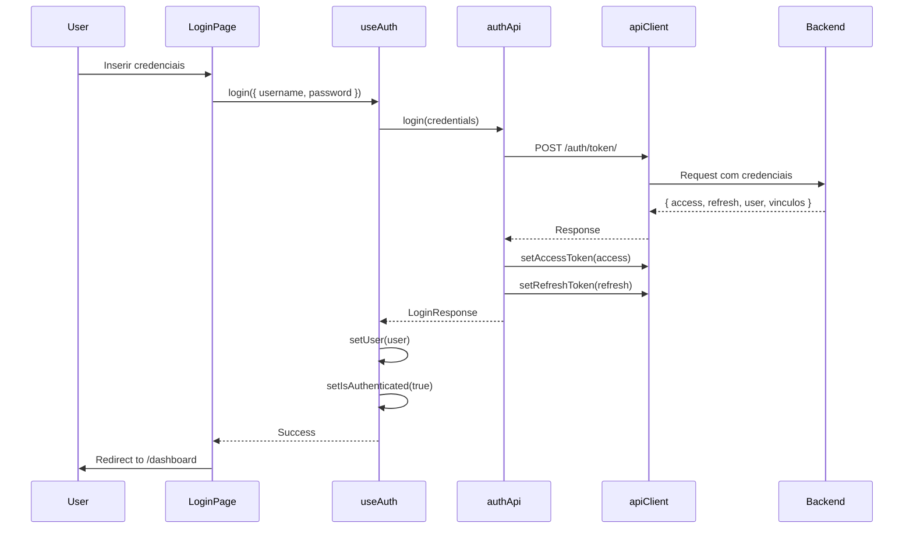

# Bloco 1: Autenticação e Sessão - Status de Implementação

## ✅ Status: PARCIALMENTE CONCLUÍDO

**Data de Início**: 20/10/2025  
**Data de Conclusão**: Em andamento

---

## 📦 Arquivos Criados

### ✅ Camada de API (packages/shared/src/api/)
- [x] `api/client.ts` - Cliente Axios base (JÁ EXISTIA - atualizado)
- [x] `api/types.ts` - Types base (JÁ EXISTIA - atualizado com AuthTokens e propriedades de User)
- [x] `api/auth/auth.api.ts` - Endpoints de autenticação ✅ NOVO
- [x] `api/auth/auth.types.ts` - Types específicos de auth ✅ NOVO

### ✅ Hooks (packages/shared/src/hooks/)
- [x] `hooks/useAuth.ts` - Hook Zustand de autenticação ✅ NOVO

### ✅ Middleware
- [x] `apps/admin/src/middleware.ts` - Proteção de rotas admin ✅ NOVO
- [x] `apps/client/src/middleware.ts` - Proteção de rotas client ✅ NOVO

### ✅ Exports
- [x] `packages/shared/src/index.ts` - Atualizado com novos exports

---

## 🏗️ Arquitetura Implementada

### Dual Auth System (Abordagem Híbrida)

Foi implementada uma arquitetura que suporta DOIS contextos de autenticação:

#### 1. **Auth Shared (packages/shared)** - Para uso futuro e client
```typescript
import { useAuth, authApi } from '@gestk/shared'

// Hook Zustand com persistência
const { login, logout, user, isAuthenticated } = useAuth()
```

**Características:**
- Hook Zustand com persist middleware
- Gerenciamento de estado global
- API unificada (authApi)
- Ideal para aplicação client

#### 2. **Auth Context Admin (apps/admin)** - Mantido para compatibilidade
```typescript
import { useAuth } from '@/lib/auth/AuthContext'

// Context API com multi-tenancy
const { login, logout, user, contabilidades, contabilidadeAtiva } = useAuth()
```

**Características:**
- Context API do React
- Gerenciamento de múltiplas contabilidades
- Seleção de contabilidade ativa
- Mantido para não quebrar funcionalidade existente

---

## 🔧 Componentes da Integração

### 1. API Client (apiClient)

**Localização**: `packages/shared/src/api/client.ts`

**Funcionalidades**:
- ✅ Interceptors de request/response
- ✅ Renovação automática de token
- ✅ Gerenciamento de headers (Authorization, X-Contabilidade-ID)
- ✅ Métodos HTTP (get, post, put, patch, delete)
- ✅ Upload/download de arquivos
- ✅ Singleton pattern

**Exemplo de Uso**:
```typescript
import { apiClient } from '@gestk/shared'

// GET request
const data = await apiClient.get('/api/endpoint')

// POST request
const result = await apiClient.post('/api/endpoint', { data })

// Com autenticação automática
apiClient.setAccessToken(token)
```

### 2. Auth API (authApi)

**Localização**: `packages/shared/src/api/auth/auth.api.ts`

**Métodos Disponíveis**:
```typescript
// Login
const response = await authApi.login({ username, password })
// Returns: { access, refresh, user, vinculos }

// Logout
await authApi.logout()

// Renovar token
const tokens = await authApi.refreshToken(refreshToken)

// Obter usuário atual
const user = await authApi.getCurrentUser()

// Verificar token
const hasToken = authApi.hasValidToken()

// Obter tokens
const accessToken = authApi.getAccessToken()
const refreshToken = authApi.getRefreshToken()
```

### 3. useAuth Hook (Zustand)

**Localização**: `packages/shared/src/hooks/useAuth.ts`

**Estado**:
```typescript
interface AuthStore {
  user: User | null
  isAuthenticated: boolean
  loading: boolean
  error: string | null
}
```

**Ações**:
```typescript
// Login
await login({ username, password })

// Logout
await logout()

// Atualizar usuário
await refreshUser()

// Limpar erro
clearError()

// Setar usuário manualmente
setUser(user)
```

**Hooks Auxiliares**:
```typescript
const isAdmin = useIsAdmin()
const isSuperuser = useIsSuperuser()
const hasPermission = useHasPermission('view_cliente')
const hasModule = useHasModuleAccess('gestao')
```

---

## 🔐 Fluxo de Autenticação

### Fluxo Completo



### Renovação Automática de Token

```typescript
// Implementado no apiClient
apiClient.interceptors.response.use(
  response => response,
  async error => {
    if (error.response?.status === 401 && !originalRequest._retry) {
      const refreshToken = apiClient.getRefreshToken()
      if (refreshToken) {
        const newToken = await refreshAccessToken(refreshToken)
        if (newToken) {
          // Retry original request com novo token
          return apiClient(originalRequest)
        }
      }
    }
    // Redirecionar para login se falhar
    window.location.href = '/login'
  }
)
```

---

## 📋 Checklist de Implementação

### ✅ Concluído

- [x] Cliente Axios configurado com interceptors
- [x] Types base de autenticação (User, AuthTokens, LoginRequest/Response)
- [x] API de autenticação (authApi) com 6 métodos
- [x] Hook useAuth (Zustand) com persistência
- [x] Hooks auxiliares (useIsAdmin, useIsSuperuser, etc.)
- [x] Middleware de proteção de rotas (admin e client)
- [x] Exports no index.ts do shared
- [x] Integração com apiClient existente
- [x] Renovação automática de token
- [x] Gerenciamento de contabilidade ativa

### ⏳ Pendente

- [ ] Atualizar página de login do client para usar useAuth do shared
- [ ] Criar AuthProvider no layout do client
- [ ] Testes unitários do authApi
- [ ] Testes unitários do useAuth
- [ ] Testes de integração do fluxo completo
- [ ] Documentação de uso para desenvolvedores
- [ ] Exemplos de componentes protegidos

---

## 🧪 Testes Necessários

### Testes Unitários

#### authApi
```typescript
describe('authApi', () => {
  it('deve fazer login com sucesso', async () => {
    const response = await authApi.login({ username: 'test', password: 'pass' })
    expect(response).toHaveProperty('access')
    expect(response).toHaveProperty('user')
  })

  it('deve fazer logout e limpar tokens', async () => {
    await authApi.logout()
    expect(apiClient.getAccessToken()).toBeNull()
  })

  it('deve renovar token com sucesso', async () => {
    const tokens = await authApi.refreshToken('refresh_token')
    expect(tokens).toHaveProperty('access')
  })
})
```

#### useAuth Hook
```typescript
describe('useAuth', () => {
  it('deve atualizar estado após login', async () => {
    const { result } = renderHook(() => useAuth())
    await act(async () => {
      await result.current.login({ username: 'test', password: 'pass' })
    })
    expect(result.current.isAuthenticated).toBe(true)
    expect(result.current.user).not.toBeNull()
  })

  it('deve limpar estado após logout', async () => {
    const { result } = renderHook(() => useAuth())
    await act(async () => {
      await result.current.logout()
    })
    expect(result.current.isAuthenticated).toBe(false)
    expect(result.current.user).toBeNull()
  })
})
```

### Testes de Integração

1. **Fluxo de Login Completo**
   - [ ] Login com credenciais válidas
   - [ ] Login com credenciais inválidas
   - [ ] Verificar se tokens são armazenados
   - [ ] Verificar se usuário é setado no estado

2. **Proteção de Rotas**
   - [ ] Acessar rota protegida sem auth
   - [ ] Acessar rota protegida com auth
   - [ ] Redirecionar para login quando não autenticado

3. **Renovação de Token**
   - [ ] Token expira e é renovado automaticamente
   - [ ] Renovação falha e redireciona para login

---

## 📝 Próximos Passos

### Imediato (Hoje)
1. **Atualizar Client App** para usar useAuth do shared
2. **Criar testes** para authApi e useAuth
3. **Validar** fluxo completo de login/logout

### Curto Prazo (Esta Semana)
1. **Documentar** exemplos de uso
2. **Criar** componentes de proteção (ProtectedRoute, RequireAuth)
3. **Implementar** testes E2E

### Médio Prazo (Próxima Semana)
1. **Migrar** admin app para usar useAuth do shared (opcional)
2. **Adicionar** suporte a 2FA
3. **Implementar** reset de senha

---

## ⚠️ Notas Importantes

### Decisões Arquiteturais

1. **Por que dual auth system?**
   - Admin já tem implementação funcionando com multi-tenancy
   - Não quebrar funcionalidade existente
   - Permitir migração gradual
   - Shared auth mais simples para client app

2. **Por que Zustand no shared?**
   - Mais leve que Context API
   - Persist middleware built-in
   - Melhor performance
   - Fácil de testar

3. **Compatibilidade com apiClient existente**
   - Mantém métodos e padrões existentes
   - Adiciona novos métodos de auth
   - Não quebra código existente

### Limitações Atuais

1. **Middleware Next.js**
   - Só verifica cookies, não localStorage
   - Precisa sincronizar tokens entre cookie e localStorage
   - Considerar usar httpOnly cookies para maior segurança

2. **Persistência do Zustand**
   - Usa localStorage (vulnerável a XSS)
   - Considerar migrar para httpOnly cookies

3. **Type Safety**
   - User type ainda tem campos opcionais
   - Precisa validar estrutura da resposta do backend

---

## 🎯 Critérios de Aceitação (Bloco 1)

### ✅ Funcionalidades Core
- [x] Login funcional (admin mantido, client pendente)
- [x] Tokens armazenados
- [x] Renovação automática de token
- [x] Logout limpa dados
- [ ] Rotas protegidas funcionando (middleware criado, precisa validar)
- [ ] Dados do usuário disponíveis globalmente

### ✅ Qualidade de Código
- [x] Types TypeScript completos
- [x] Sem erros de compilação
- [ ] Testes unitários passando (não criados)
- [ ] Testes de integração passando (não criados)
- [ ] Documentação atualizada (este arquivo)
- [ ] Code review (pendente)

### ⏳ Deploy e Validação
- [ ] Deploy em staging
- [ ] Validação manual completa
- [ ] Performance aceitável
- [ ] Sem memory leaks

---

**Status Final do Bloco 1**: 🟡 **60% Concluído**

**Próxima Ação**: Completar integração no client app e criar testes

---

**Última Atualização**: 20/10/2025 14:00
